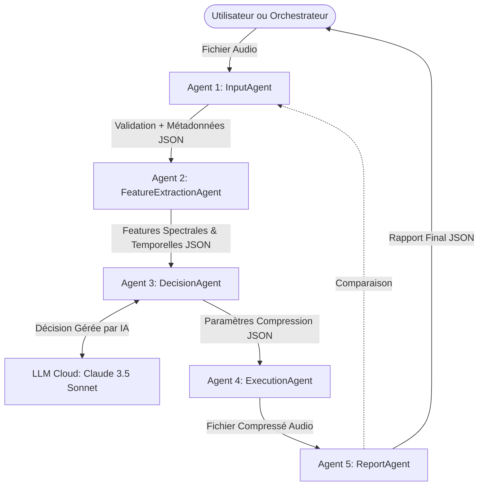

# 🏗 Architecture Multi-Agents du Système de Compression Audio

Ce document décrit l'architecture technique du projet, qui est basée sur un modèle de micro-services avec **5 agents indépendants** communiquant de manière asynchrone pour traiter un flux de données continu.

---

## 1. Vue d'Ensemble du Flux de Travail

Le workflow complet orchestre le passage d'un fichier source non compressé à un fichier compressé de manière chirurgicale, avec des rapports détaillés. La communication est effectuée via transfert JSON.

---

## 2. Description Détaillée des Agents

### AGENT 1: Input Agent
**└─ Rôle:** Validateur et extracteur de métadonnées basiques.
**└─ Responsabilités:**
     - Charger le fichier depuis le disque local.
     - Utiliser `ffprobe` pour extraire des informations système sans décoder le fichier.
     - Vérifier la validité des headers, codecs et canaux (1-8 supportés).
     - Gérer les erreurs de path ou de format (`.wav`, `.mp3`, `.ogg`, `.flac`...).
**└─ Entrées:** Path absolu en format string (`{"filepath": "/..."}`).
**└─ Sorties:** `AudioMetadata` (Format JSON, contenant dureté, SNR théorique, channels, codecs, etc.).
**└─ Dépendances:** `FFprobe` / `subprocess`.
**└─ Implémentation:** Fichier `input_agent.py` → Classe `InputAgent` → Fonction `load_and_validate`.
**└─ Points de défaillance:** Fichier inexistant, Timeout FFprobe (Timeout fixé à 15s), Format invalide non parsable.

### AGENT 2: Feature Extraction Agent
**└─ Rôle:** Détection de caractéristiques spectrales et catégorisation de contenu.
**└─ Responsabilités:**
     - Charger et décoder la waveform audio.
     - Calcul par Fast Fourier Transform (FFT) via `librosa`.
     - Extraire des indices comme le Centroid, RMSE, Zero Crossing Rate et Spectral Bandwidth.
     - Détecter le profil: **Voice**, **Music**, **Ambient** ou **Mixed**.
**└─ Entrées:** Path absolu du fichier Audio.
**└─ Sorties:** `AudioFeatures` (Format JSON: centroid, entropy, content_type...).
**└─ Dépendances:** `librosa`, `numpy`.
**└─ Implémentation:** Fichier `feature_extraction_agent.py` → Classe `FeatureExtractionAgent` → Fonction `extract`.
**└─ Points de défaillance:** Fichier vide (array len == 0) après parsing, saturation mémoire (OOM) sur des fichiers très larges. C'est pourquoi un target_sr de 44100 est fixé à l'entrée.

### AGENT 3: Decision Agent
**└─ Rôle:** Pilote d'Intéligence Artificielle pour la rationalisation des codecs.
**└─ Responsabilités:**
     - Formater les objets `AudioMetadata` et `AudioFeatures` au sein d'un prompt ciblé.
     - Communiquer avec Anthropic API (Claude 3.5 Sonnet).
     - Effectuer le fallback vers un algorithme purement logique (If/Else) si la connexion API échoue ou si le token crache.
     - Transcrire l'audio texte si la route NLP DeepGram est touchée.
**└─ Entrées:** Objets `AudioMetadata` + `AudioFeatures`.
**└─ Sorties:** `CompressionDecision` (Format JSON: le codec suggéré, bitrate, hz et la justification logicielle).
**└─ Dépendances:** `anthropic`, APIs Rest (`google-generativeai` potentiellement supporté).
**└─ Implémentation:** Fichier `decision_agent.py` → Classe `DecisionAgent` → Fonction `decide`.
**└─ Points de défaillance:** Coupure internet, Exhaustion tokens API, Parse d'une malformed JSON output par l'IA.

### AGENT 4: Execution Agent
**└─ Rôle:** Ouvrier logiciel exécutant la tâche matérielle de compression.
**└─ Responsabilités:**
     - Analyser les prérequis reçus du décisionnaire.
     - Traduire ces prérequis en arguments d'invite de commande valides au standart FFmpeg.
     - Surveiller et attraper les exceptions de rendu ou codec.
     - Renommer et stocker le nouvel asset exporté.
**└─ Entrées:** Path originel + `codec`, `bitrate_kbps`, `sample_rate_hz`, `channels`.
**└─ Sorties:** `CompressionResult` (Format JSON: paths, tailles avant/après et taux).
**└─ Dépendances:** `FFmpeg` / `subprocess`.
**└─ Implémentation:** Fichier `execution_agent.py` → Classe `ExecutionAgent` → Fonction `compress`.
**└─ Points de défaillance:** FFmpeg binaire introuvable, Erreur de timeout Subprocess (fixé à 300s).

### AGENT 5: Report Agent
**└─ Rôle:** Arbitre qualitatif post-production.
**└─ Responsabilités:**
     - Loader en parralèle le fichier d'origine et le ficher compressé via librosa.
     - Couper dynamiquement l'excès de décodage à la longneur de la waveform la plus courte.
     - Calcul trigonométrique du SNR (`10 * log10(signal / bruit)`)
     - Construire le tableau Markdown et le log JSON de fin de cycle.
**└─ Entrées:** Le Target Originel et Target Modifié + Les paramètres techniques du DecisionAgent.
**└─ Sorties:** `CompressionReport` (Fichier JSON dumpé).
**└─ Dépendances:** `librosa`, `numpy`, `json`.
**└─ Implémentation:** Fichier `report_agent.py` → Classe `ReportAgent` → Fonction `generate`.
**└─ Points de défaillance:** OutOfMemory Exception car l'agent charge 2x le buffer audio en RAM, crashs mathématiques (bruit null conduisant à div0).

---

## 3. Communication Inter-Agents
- Le design Pattern appliqué est le **REST Request / JSON payload**. 
- Bien que le fichier `orchestrator.py` exécute les agents en mémoire Python partagée via l'instantiation des classes (`result = self.execution_agent.compress()`), le design backend principal repose sur l'exposition de **FastAPI Routes**, rendant ces agents parfaits pour des Workers Serverless et distribués.
- Les artifacts (Metadata, Decision, Features) génèrent des états de "Snapshot" sérialisés stockés en intermédiaire sur le disque (`manifests/*.json`).

---

## 4. Gestion des Erreurs et FallBack

- Le point critique numéro un dans un système Agentic est la défaillance possible du LLM ou sa latence induite.
Le système a mis en place un **système de Fallback interne** (`fallback_decision`) qui se déclenche automatiquement si le LLM n'arrive pas à parser l'output, ou en l'absence de clé dans le `.env`.
   - **Logique de substitution simple :**
     - Voice -> Opus / 64 Kbps (Maintien de l'intelligibilité, suppression des canaux stéréo).
     - Music -> AAC / 192 Kbps (Préservation détaillée du panoramique stéréo et de la chaleur).
     - Mixed -> AAC / 128 Kbps (Mixte équilibré en stéréo ou mono asimetrique).

- Les sous-processus `subprocess` incluent tous une logique asynchrone avec attente maximale par `timeout` (15s pour probe, 300s pour encode) pour empêcher le blocage d'un endpoint worker FastAPI de façon illimité.
